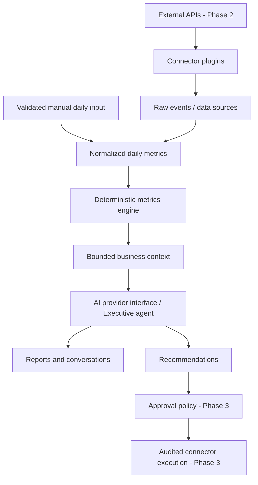

# DMS Executive AI

## Architecture and delivery boundary

The platform includes the Phase 1 executive workspace and Phase 2 read-integration infrastructure. Six provider adapters import independently normalized source metrics through encrypted credentials and a BullMQ worker. See [Phase 2](PHASE_2.md) for connector coverage and restrictions. Demo is explicitly labeled and isolated in browser storage. Production data uses MySQL through Prisma and verified Supabase bearer sessions. Connections are marked connected only after provider verification. Phases 3–5 remain planned.

## Trust boundaries

Every production API validates a Supabase access token, resolves organization membership, and scopes every business query to that organization. Mutations require owner/admin/member privileges; viewers cannot write. Tenant IDs supplied by clients are not trusted. Initial organization provisioning is transactional. All metric values are validated; currency is SAR for this MVP and amounts are stored as decimals. Daily input replaces one complete daily record rather than adding duplicate revenue. Database-backed rate limits protect AI calls across instances. Server errors return a correlation ID without credentials or raw provider responses.

Credential encryption uses AES-256-GCM with random IVs and authentication tags. The key is server configuration, outside the database. Future connectors must implement OAuth state verification, PKCE where supported, scoped permissions, token refresh, webhook signature verification and idempotent imports before being enabled. AI receives aggregate metrics only, with no credentials, customer records or email bodies. AI output is advisory text and has no action tools.

## Persistence and schema

Prisma contains separate relational tables for users, organizations, membership, businesses, integrations, encrypted credentials, data sources, daily metrics, metric snapshots, events, alerts, recommendations, insights, conversations, memories, reports, tasks, projects, clients, approvals, automation rules and audit logs. Every business resource has a business foreign key and scoped index. Tables for later phases establish storage boundaries only: they do not imply those modules or workflows are already operational. Their domain constraints and relationships will be extended with the corresponding phase.

## Folder structure

`src/app`: pages and HTTP boundary. `src/components`: bilingual dashboard and UI primitives. `src/modules/metrics`: pure financial calculations and demo fixtures. `src/modules/integrations`: provider-independent contracts/catalog. `src/modules/ai`: context and provider adapter. `src/lib`: auth, database, encryption, HTTP errors. `prisma`: relational schema and migrations. `tests`: financial and security regression tests.

## Phase 3 operations

`src/modules/operations` exposes a portable service, command validation, role policy and deterministic completed-day rule evaluation. Its Prisma adapter serializes each business's operations, validates immutable approval payloads and commits internal task execution with decisions and audit records. A unique rule/window key and task source key prevent duplicate effects. A separate BullMQ schedule evaluates due businesses. See [Phase 3](PHASE_3.md) for semantics, authorization, supported actions and limitations.

## Next phases

Phase 2 follow-ups: Search Console, Gmail, Calendar and commerce enrichment. Phase 3 follow-ups: external action executors and outbound notifications. Phase 4: finance/forecasting with backtesting, missing-data coverage and specialist agent orchestration. Phase 5: explicitly scoped autonomous actions with spend limits and revocation.

## Deployment gates

Production readiness requires configured Supabase and provider apps with verified redirect URLs, MySQL migrations and backups, private persistent Redis, the sync worker, TLS/reverse proxy, secret management, monitoring, security review and real-provider acceptance tests. This repository is a runnable foundation, not certification of a production deployment. Hourly read synchronization and Google OAuth are implemented; marketplace onboarding, billing and autonomous actions are not.

Sources: [Next.js authentication](https://nextjs.org/docs/app/guides/authentication), [OpenAI text generation](https://developers.openai.com/api/docs/guides/text), [Prisma 6 MySQL](https://www.prisma.io/docs/orm/v6/overview/databases/mysql).
